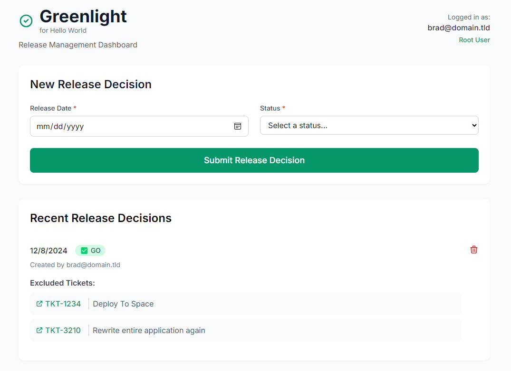

# Greenlight - Release Management Dashboard



A modern web application for managing software releases, built with Hono.js and running on Cloudflare Workers. Designed to operate behind Cloudflare Zero Trust for secure authentication and access control.

## Features

- 🚦 GO/NO-GO release decisions
- 🎫 JIRA ticket integration with real-time validation
- 📧 HTML email notifications with ticket details
- 👥 User authentication via Cloudflare Access
- 🔐 Role-based access control (root users)
- 💅 Modern UI with Tailwind CSS and HTMX
- 🔄 Real-time UI updates without page reloads
- 🔒 Secure access via Cloudflare Zero Trust authentication

## Project Structure

```
src/
├── index.js              # Application entry point and route definitions
├── routes.js             # Route handlers for all endpoints
├── auth.js               # Authentication and authorization utilities
├── database.js           # Database operations and schema management
├── emailNotifications.js # Email notification functionality
├── jiraIntegration.js    # JIRA API integration and validation
└── ui.js                 # UI components and rendering functions
```

## Setup Instructions

### 1. Configure Cloudflare Zero Trust
1. Set up a Cloudflare Zero Trust account if you haven't already
2. Create a new application in Zero Trust:
   - Go to "Access" > "Applications"
   - Click "Add an application" > "Self-hosted"
   - Configure your application settings:
     - Name: Your application name
     - Session Duration: As needed (e.g., 24 hours)
     - Domain: Your application's domain
3. Create an access policy:
   - Add rules to determine who can access the application
   - Configure authentication providers (e.g., Google Workspace, Okta)
4. Note the application domain - you'll need this for deployment

### 2. Clone and Install Dependencies
```bash
git clone https://github.com/bradmb/greenlight
cd greenlight
npm install
```

### 3. Set Up D1 Database
1. Create a new D1 database:
```bash
npx wrangler d1 create greenlight
```

2. You'll receive output like this:
```
✅ Successfully created DB 'greenlight' in region WNAM
Created your new D1 database.

[[d1_databases]]
binding = "DB"
database_name = "greenlight"
database_id = "bbf2cf65-3e81-4a04-bab5-21e673e1dbb0"
```

3. Copy the provided configuration into your `wrangler.toml` file under the `[[d1_databases]]` section.

### 4. Set Up KV Storage
1. Create the main KV namespace:
```bash
npx wrangler kv:namespace create "app_state"
```

2. Create the preview KV namespace:
```bash
npx wrangler kv:namespace create "app_state" --preview
```

3. You'll receive output like this for the main namespace:
```
🌀 Creating namespace with title "greenlight-app_state"
✨ Success!
[[kv_namespaces]]
binding = "app_state"
id = "468881005e4d48dc8a2a0b9436b10ac3"
```

4. And for the preview namespace:
```
🌀 Creating namespace with title "greenlight-app_state_preview"
✨ Success!
[[kv_namespaces]]
binding = "app_state"
preview_id = "622c246f2dc84eb6b389fa2a850f710d"
```

5. Combine both outputs in your `wrangler.toml`:
```toml
[[kv_namespaces]]
binding = "APP_STATE"
id = "468881005e4d48dc8a2a0b9436b10ac3"
preview_id = "622c246f2dc84eb6b389fa2a850f710d"
```

### 5. Configure Environment Variables
Create a `.dev.vars` file for local development:
```env
# JIRA Integration
JIRA_BASE_URL=       # JIRA instance URL (e.g., https://your-domain.atlassian.net)
JIRA_USER_EMAIL=     # JIRA user email for API access
JIRA_API_TOKEN=      # JIRA API token for authentication

# Email Notifications
NOTIFICATION_EMAIL_TO=   # Comma-separated list of notification recipients
NOTIFICATION_EMAIL_FROM= # Email address to send notifications from

# Authentication
ROOT_USERS=              # Comma-separated list of root user emails
```

### 6. Configure Email Routing in Cloudflare
1. Go to your Cloudflare dashboard and navigate to "Email" > "Email Routing"
2. Enable Email Routing if not already enabled
3. Configure routing rules:
   - Add your sender address (configured in `NOTIFICATION_EMAIL_FROM`) as a custom address
   - Add destination addresses (matching `NOTIFICATION_EMAIL_TO`) as verified recipients
4. Test the email routing by sending a test email

### 7. Development
Run the development server:
```bash
npm run dev
```

### 8. Deployment
Deploy to Cloudflare Workers:
```bash
npx wrangler deploy
```

## Architecture

The application follows a modular architecture with clear separation of concerns:

- **Routes** (`routes.js`): Handles HTTP requests and coordinates business logic
- **Auth** (`auth.js`): Manages user authentication and authorization via middleware
- **Database** (`database.js`): Handles all database operations with transaction support
- **Email** (`emailNotifications.js`): Manages HTML email notifications with ticket details
- **JIRA** (`jiraIntegration.js`): Handles JIRA API integration and ticket validation
- **UI** (`ui.js`): Contains all UI components and rendering logic with HTMX integration

## API Endpoints

- `GET /` - Main dashboard page
- `GET /api/releases` - Get list of releases (HTML fragment)
- `POST /api/releases` - Create a new release
- `DELETE /api/releases/:id` - Delete a release (root users only)
- `GET /api/validate-jira/:ticketKey` - Validate a JIRA ticket in real-time

## Database Schema

The application uses two main tables with soft delete support:

### Releases
```sql
CREATE TABLE releases (
  id INTEGER PRIMARY KEY AUTOINCREMENT,
  release_date DATE NOT NULL,
  status TEXT CHECK(status IN ('GO', 'NO_GO')) NOT NULL,
  explanation TEXT,
  created_by TEXT NOT NULL,
  created_at DATETIME DEFAULT CURRENT_TIMESTAMP,
  updated_by TEXT,
  updated_at DATETIME,
  deleted_at DATETIME,
  deleted_by TEXT
)
```

### Excluded Tickets
```sql
CREATE TABLE excluded_tickets (
  id INTEGER PRIMARY KEY AUTOINCREMENT,
  release_id INTEGER NOT NULL,
  ticket_key TEXT NOT NULL,
  ticket_summary TEXT,
  ticket_url TEXT,
  created_by TEXT NOT NULL,
  created_at DATETIME DEFAULT CURRENT_TIMESTAMP,
  FOREIGN KEY (release_id) REFERENCES releases(id)
)
```

## Technologies Used

- [Hono.js](https://honojs.dev/) - Fast, modern web framework
- [Cloudflare Workers](https://workers.cloudflare.com/) - Edge computing platform
- [Cloudflare D1](https://developers.cloudflare.com/d1/) - SQLite database at the edge
- [HTMX](https://htmx.org/) - Dynamic UI updates without JavaScript
- [Tailwind CSS](https://tailwindcss.com/) - Utility-first CSS framework
- [Inter Font](https://rsms.me/inter/) - Modern typography

## Features in Detail

### Release Management
- Create GO/NO-GO release decisions
- Attach JIRA tickets to releases with real-time validation
- Automatic ticket summary and URL fetching from JIRA
- Soft delete support for audit trails

### Email Notifications
- HTML-formatted emails for better readability
- Includes release status, date, and creator
- Lists all excluded tickets with summaries
- Sent automatically on release creation

### JIRA Integration
- Real-time ticket validation
- Automatic ticket summary fetching
- Direct links to JIRA tickets
- Error handling for invalid tickets

### User Interface
- Clean, modern design with Tailwind CSS
- Real-time form validation
- Dynamic ticket input fields
- Loading indicators for better UX
- Responsive layout for all devices